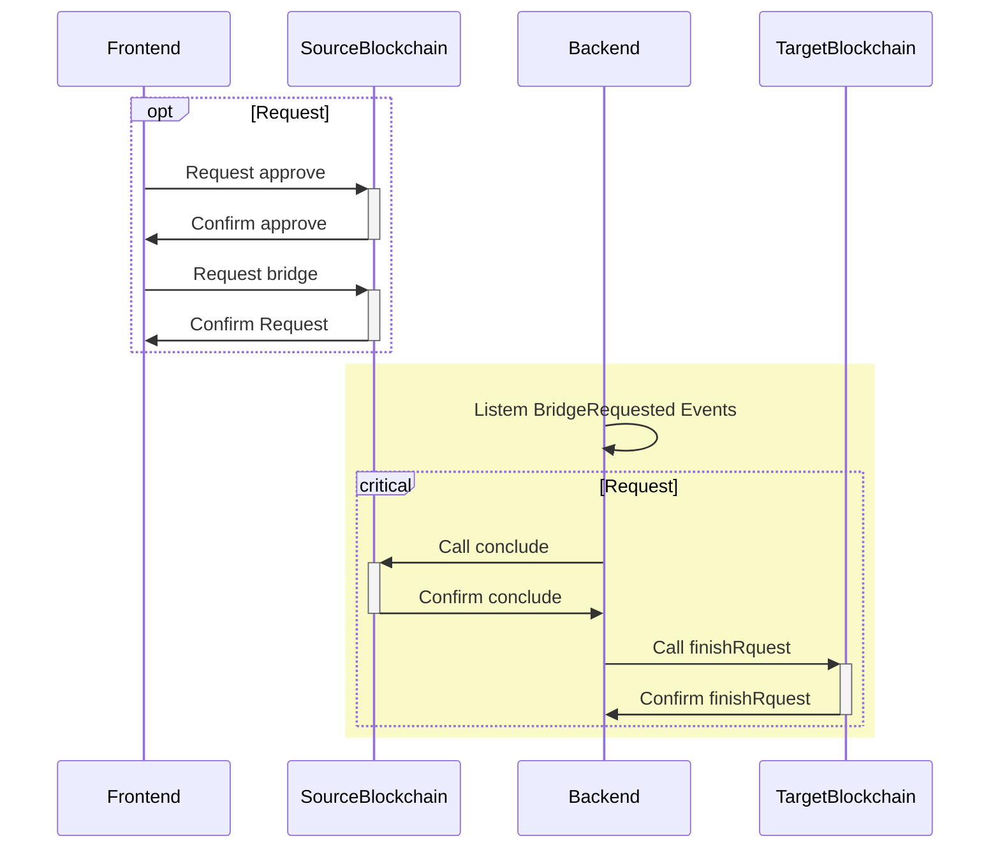

### Success Flow

```mermaid
sequenceDiagram
        participant Frontend
        participant SourceBlockchain
        participant Backend
        participant TargetBlockchain


        opt Request
          Frontend->>+SourceBlockchain: Request approve
          SourceBlockchain->>-Frontend: Confirm approve
          Frontend->>+SourceBlockchain: Request bridge
          SourceBlockchain->>-Frontend: Confirm Request
        end


        rect rgb(250,250,200)
          Backend ->> Backend: Listem BridgeRequested Events
          critical Request
            Backend->>+SourceBlockchain: Call conclude 
            SourceBlockchain->>-Backend: Confirm conclude
            Backend->>+TargetBlockchain: Call finishRquest
            TargetBlockchain->>-Backend: Confirm finishRquest
          end
        end
```